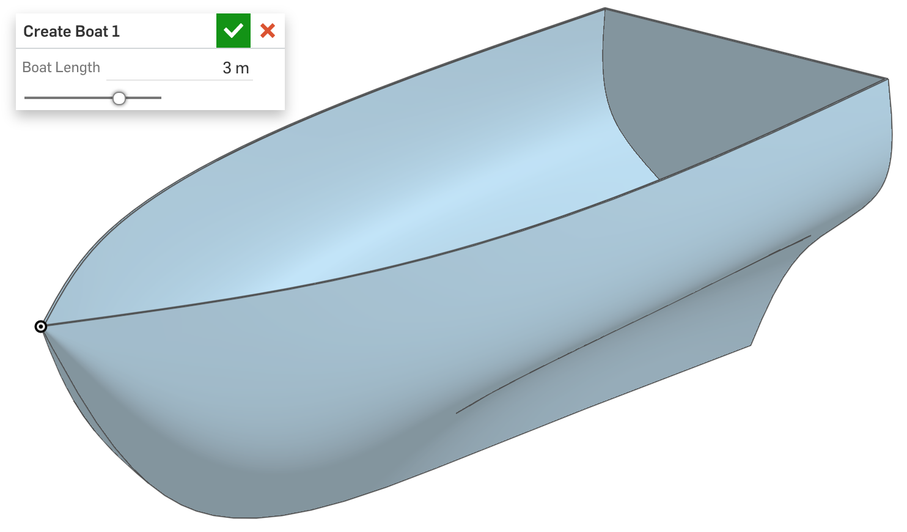

# featurescript_cad_exercises
CAD scripting exercises written in Onshape's FeatureScript.

### 1. Interwoven Star sketch

This feature draws a simple 2D pattern, taking parameters for the width, height, and display of gridlines.

### 2. Boat 3D model

This feature creates a 3D model of a boat, taking one parameter for the length and scaling all other dimensions based upon that.

### 3. Lego brick generator

This feature creates a 3D model of a rectangular Lego brick, taking parameters for the brick's location and its dimensions in studs. Differing internal support systems are generated for 1x1, 1xN, 2xN, and 3xN bricks.

